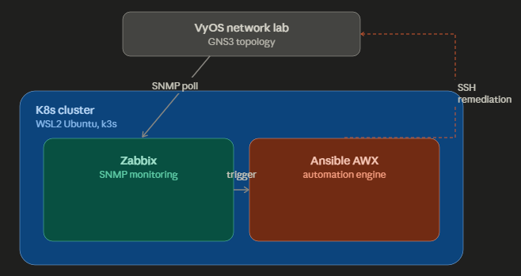

# 2026_netops-monitoring-platform
Network monitoring &amp; auto-remediation lab using VyOS, Zabbix, Ansible, and Kubernetes (k3s)

# 네트워크 모니터링 & 자동화 플랫폼

## 0. 아키텍처

## 0-1. 아키텍처 변경 이력

**[2026-07-16]** GNS3 실행 환경 변경: VirtualBox → WSL2 직접 설치

초기 계획은 GNS3 + VirtualBox 기반이었으나 WSL2(Hyper-V 기반)와 VirtualBox의 가상화가 충돌하여 KVM을 사용할 수 없는 문제를 확인했다. (TROUBLESHOOTING.md 참고)

이에 따라 GNS3를 WSL2 Ubuntu 환경에 직접 설치하는 방식으로 전환했다.
이로써 네트워크 랩(GNS3)과 모니터링 및 자동화 스택(k3s)을 동일한 WSL2 환경으로 통합하고 전체 구조를 단순화했다.

## 1. 프로젝트 개요

**목표**: 네트워크 인프라를 Zabbix로 모니터링하고, 장애 발생 시 Ansible로 자동 대응하는 파이프라인을 구축한다. Zabbix/Ansible 운영 환경은 K8s(k3s) 위에 배포하여 구성한다.

**핵심 스토리라인**: 장애 주입 → Zabbix 감지 → Ansible 자동 조치 → 복구 확인

**자격증 매핑**
| 자격증 | 프로젝트 내 역할 |
|---|---|
| CCNA/CCNP | VyOS 기반 라우팅/스위칭 설계, 장애 시나리오 설계 |
| RHCE | Ansible playbook 작성, 리눅스 서버 운영 |
| CKA | Zabbix/AWX를 K8s(k3s) 위에 배포 및 운영 |

---

## 2. 단계별 스코프 (Phase)

### Phase 1 — 코어 모니터링 (1-2주, 이번 스프린트 목표)

**범위**
- GNS3 + VyOS로 최소 토폴로지 구성: 라우터 2대 + 스위치 1대 (또는 라우터만 3대)
- k3s 클러스터 구축 (단일 노드, WSL2 Ubuntu 위)
- Zabbix server를 k3s에 Helm으로 배포 (PV/PVC 포함)
- VyOS 장비에 SNMP 활성화 → Zabbix가 인터페이스 상태/트래픽 polling
- 기본 트리거 1-2개 구성 (예: 인터페이스 down, 트래픽 임계치 초과)
- Zabbix Network Map에 토폴로지 시각화

**산출물**
- README (아키텍처 설명 + 스크린샷)
- Troubleshooting 로그 (셋업 중 막힌 지점과 해결 과정 기록)
- Zabbix dashboard 스크린샷, Network Map 스크린샷

**완료 기준(Definition of Done)**
- VyOS 라우터 하나를 강제로 shutdown 했을 때 Zabbix Network Map에서 해당 노드가 빨간색으로 바뀌고 Problem 목록에 이벤트가 뜬다

---

### Phase 2 — 자동화 연동 (다음 스프린트, 1-2주)

**범위**
- Zabbix trigger → webhook → Ansible(ansible-runner 또는 AWX) 연동
- 장애 대응 playbook 1-2개 작성
  - 예1: 인터페이스 flapping 감지 시 자동 shutdown/no shutdown
  - 예2: 설정 백업 자동화 (트리거 무관, 주기 실행)
- Ansible 실행 로그를 Zabbix Problem 화면과 나란히 캡처

**완료 기준**
- 장애 주입 → Zabbix 트리거 발생 → Ansible playbook 자동 실행 → 로그로 조치 내역 확인 가능

---

### Phase 3 — 이중화(HA) (3-4주, 확장 계획)

**범위**
- L2: STP/RSTP, LACP 포트채널
- L3: HSRP/VRRP 게이트웨이 이중화, OSPF 멀티패스
- 장애 시나리오: Primary 장비 다운 → failover → Zabbix 감지 → 로그 기록

**상태**: 로드맵 단계, 이번 스프린트 범위 아님

---

### Phase 4 — L7 로드밸런싱 (2-3주, 확장 계획)

**범위**
- HAProxy/Nginx L7 LB 구성
- 백엔드 헬스체크 상태를 Zabbix로 모니터링

**상태**: 로드맵 단계, 이번 스프린트 범위 아님

---

## 3. 산출물

### Phase 1 결과물

- Zabbix Network Map
  
zabbix_network_map.png)

VyOS-1, VyOS-2, VyOS-3 토폴로지로 SNMP polling 정상 확인
